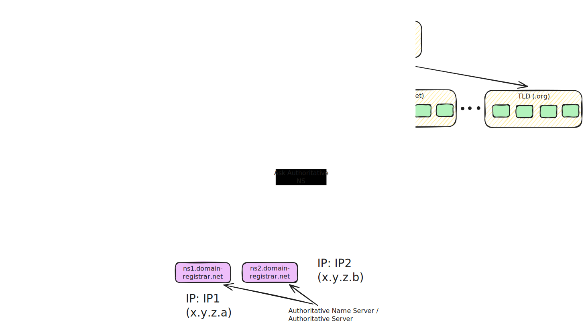
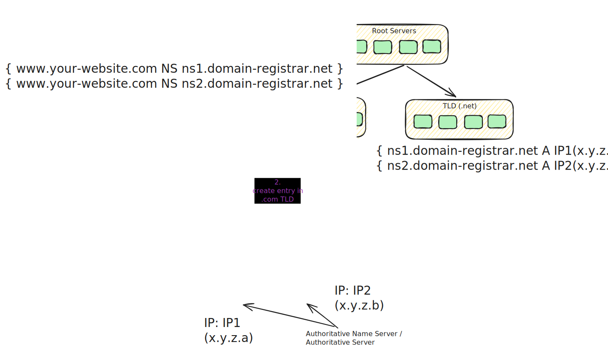
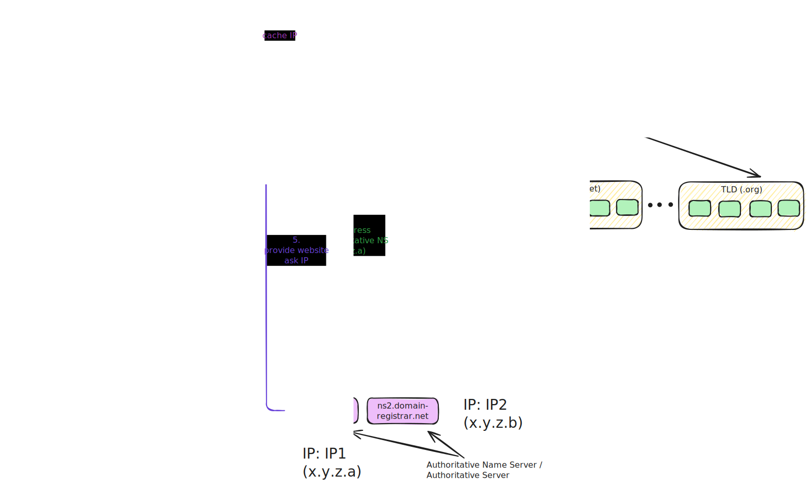
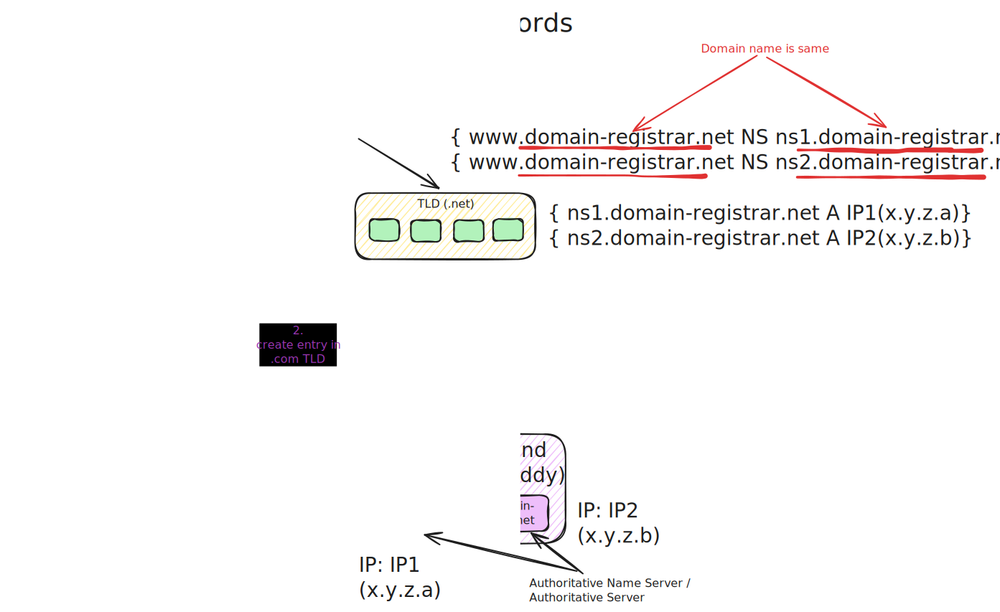

# DNS







## Glue Records

Glue records returns as **additional Records** section.

### Why do we need Glue records at first place?

Consider scenario where Domain provider like Godaddy has website where user wants to configure their websites.
In this case, domain-registrar website address is (for example)

```bash
www.domain-registrar.com
```

NameServers are:

```bash
ns1.domain-registrar.com
ns2.domain-registrar.com
```

When user tries to accesss `www.domain-registrar.com`, following happens:

1. Goes to Root Name server, Which identifies `.com` as domain and sends to `TLD (.com)`.
2. `TLD (.com)` checks for `Name Servers` of `www.domain-registrar.com` which is `ns2.domain-registrar.com`. Since it doesn't have IP address of `ns2.domain-registrar.com`, it starts the DNS resolution process again.
3. :exclamation: :exclamation: Infinite Loop :exclamation: :exclamation:


