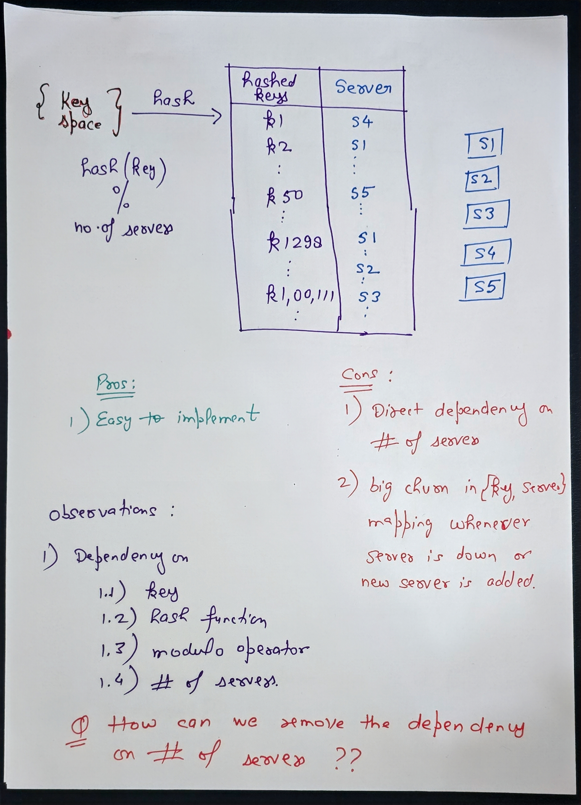
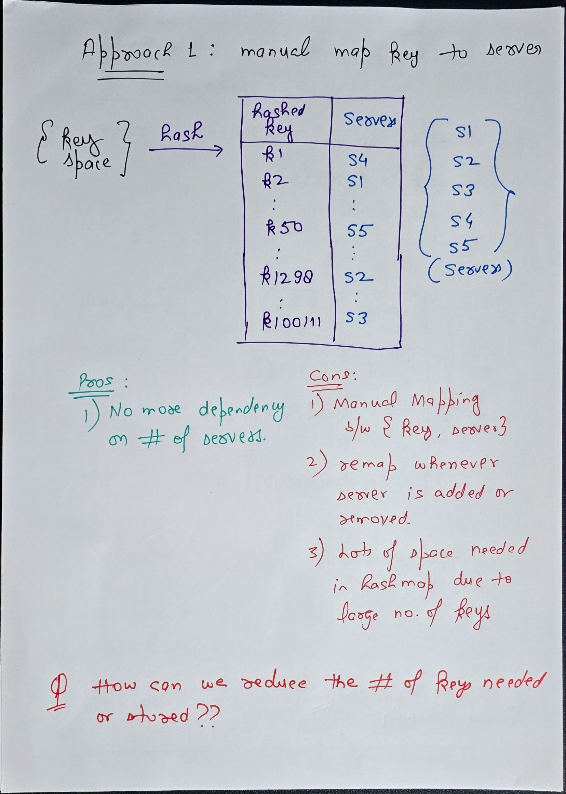
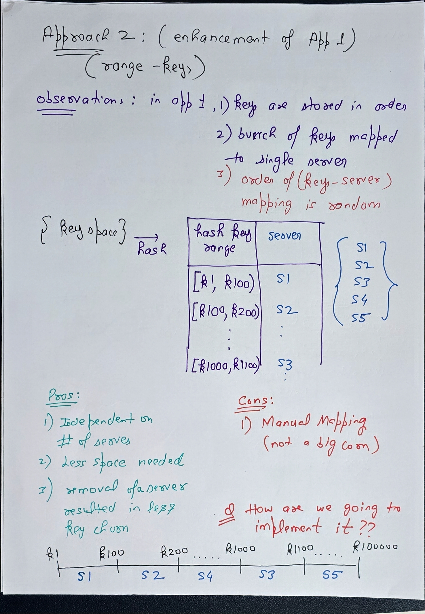
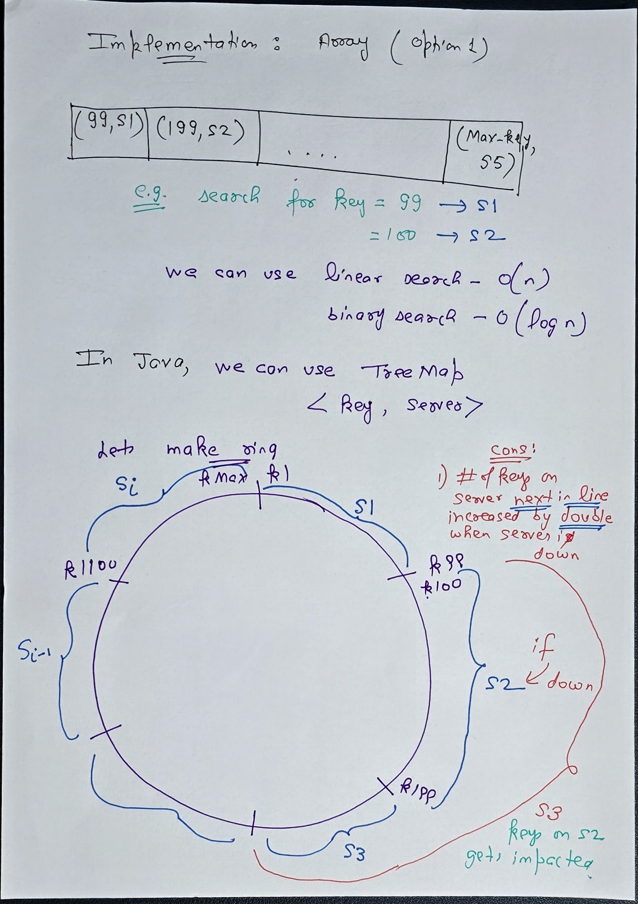
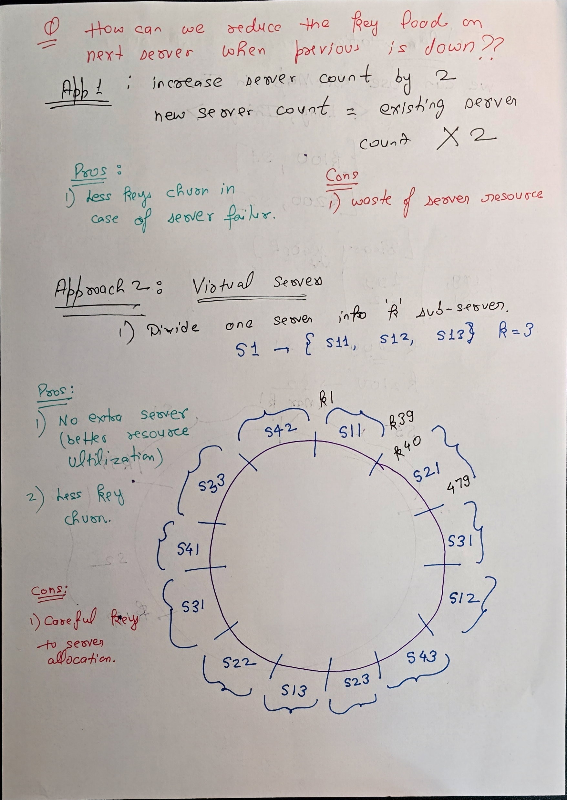
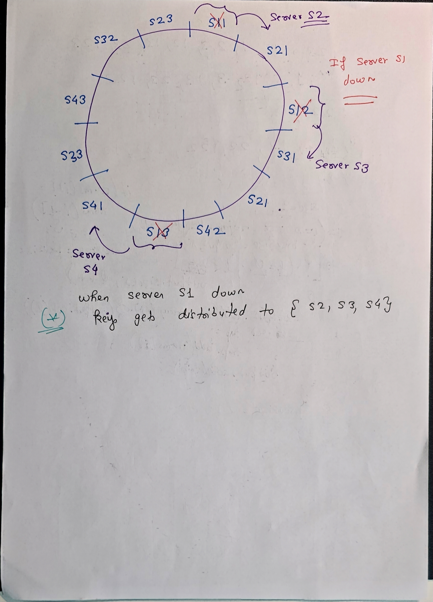

# Consistent Hashing

## What is consistent hashing

its a hashing technique in which small/relative small number of key movement happens whenever server is down or new server is added.

### Properties

1. Keys are mapped to a server.
2. Mapping of key to server is independent of number of servers.
3. It allows to map key to server based upon its access pattern.

### Question: Can we progress to consistent hashing from scrtach??

Lets start from scratch

