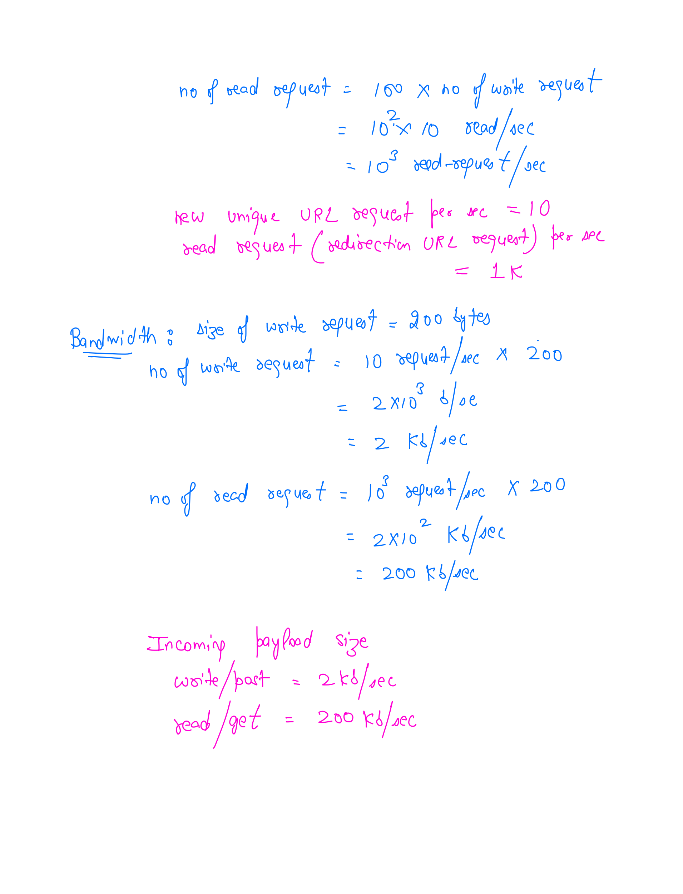

# Url Shortener Service Version 1

## Table of content
1. [Freeze the scope](#freeze-the-scope)
1. [Back of the envelop estimation](#back-to-the-envelop-estimation)

## Freeze the scope

1. How many unique urls expected to be received per day?
    * Answer: 1 million
1. What are the allowed characters in short url?
    * Answer: 0-9, a-z, A-Z
1. What is the retention period of this mapping?
    * Answer: 5 years
1. Can the url be updated or deleted?
    * Answer: skip for now.
1. Characteristics of short URL
    * It shouldn't be guessable.

## Back-to-the-envelop Estimation

Assumption:
1. Average Long URl length is 100 bytes
1. Object being stored in db is around Length of Short URL + Length of Long URL + (some other info) = 
1. **Read to write** ratio is **100:1**

## High Level Design

### Domain Name Server

DNS is being used to perform the resolution of web server URL to its IP address. [To know more about DNS Resolution](../../../Flows/DNS_Resolution.md).

### Load balancer/Application Gateway

We need some kind of load balancer which balances the load among the web servers. [Refer here to know more about them and their comparisons](../../../Comparisons/Types_Load_Balancers.md).

How to decide which one suits best? Lets enumerate our requirement and see what fits best.
1. We limit users to create long url to short url mapping based upon the pricing model. To enable this, we need  [Rate limiter](../../Rate_Limiter/Rate_Limiter.md). 
1. 

1. Need some kind of load balancer which balances the load among the web servers. There are multiple options available and criteria to choose depends upon the requirements which are following:
    1. Would like to terminate the TLS connection at load balancer side instead of Web servers. 
    1. Need [Rate limiter](../../Rate_Limiter/Rate_Limiter.md)
    1. Layer 7 load balancer fits well (Applicaiton Gateway) as this service is HTTP based. Another benifit is that we can forward the requert to specific set of web servers based upon URL Path.
    