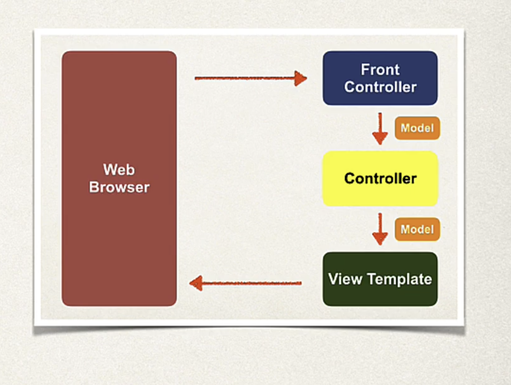

# spring framework projects
Repository contains multiple projects using the framework/boots.

## Documentations
1. [Spring boot references](https://docs.spring.io/spring-boot/docs/current/reference/html/index.html)
2. [Spring boot application properties](https://docs.spring.io/spring-boot/docs/current/reference/html/application-properties.html)
3. [Different views supports by Spring](https://docs.spring.io/spring-framework/reference/web/webmvc-view.html)
4. [Spring web MVC documentation](https://docs.spring.io/spring-framework/reference/web/webmvc.html)
5. [Spring security reference](https://docs.spring.io/spring-security/reference/index.html)
6. [Spring security reference manual](https://docs.spring.io/spring-security/site/docs/5.2.1.RELEASE/reference/htmlsingle/)
7. [Spring security samples](https://github.com/spring-projects/spring-security/tree/5.4.x/samples)

## Tomcat server 
1. [Tomcat server properties](https://docs.spring.io/spring-boot/docs/current/reference/html/application-properties.html#appendix.application-properties.server)
2. To change port: server.port=<port id>

## Thymeleaf 
1. Template files go in **src/main/resources/templates**
2. css/images/js files go in **src/main/resources/static/** (this part is fixed). 
   1. css -> **/css/demo.css**.
   2. images -> **/images/anyimage.jpg**.

## Spring MVC

1. Different views supports by Spring [here](https://docs.spring.io/spring-framework/reference/web/webmvc-view.html)

## Validation
1. [Bean validation API](https://beanvalidation.org/)
