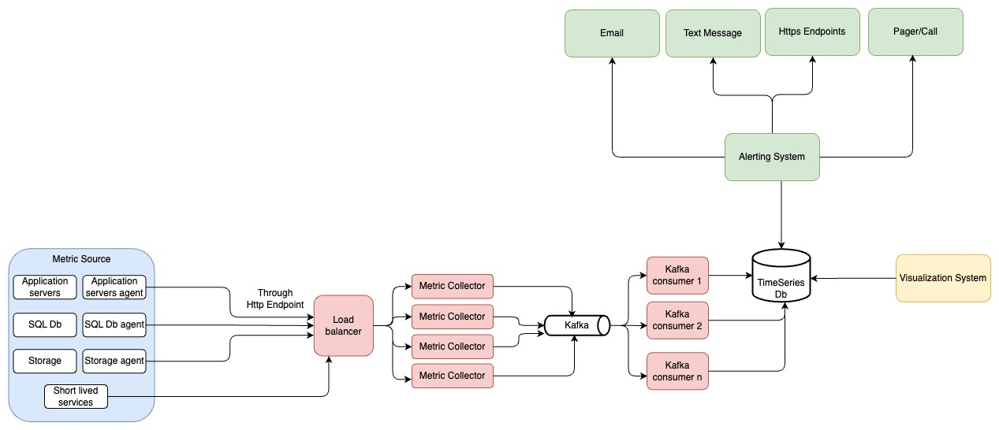
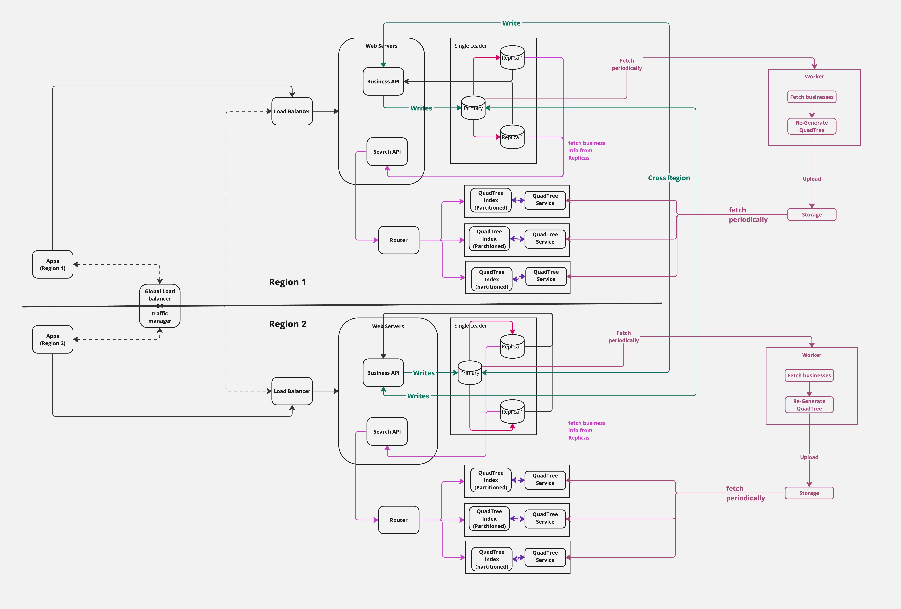

# System Design

## System Design Topics

1. [Metric and Alerting system](./System_Design_Topics/Metric_Alerting_System/Overiew.md)
     
      
2. [Proximity Service](System_Design_Topics/Proximity_Service/Overview.md)
     
   
      
3. [Design Url Shortener system](./System_Design_Topics/Url_Shortener_System/Overview.md)
4. [Design Rate Limiter service](./System_Design_Topics/Rate_Limiter_Service/Overview.md)

## Components

1. [DNS Resolution](./System_Design_Topics/Components/DNS/DNS_Resolution.md)
2. [Hashing](./System_Design_Topics/Components/Hashing/Hashing.md)

## Projects

1. [Counter App using React](Projects/counter-app-using-react/)
2. [Todo App](Projects/ToDoApp)
3. TCP Client and Server
   1. [TCP Client\Server in Java](Projects/TCP_Server/Java/tcp_server)
