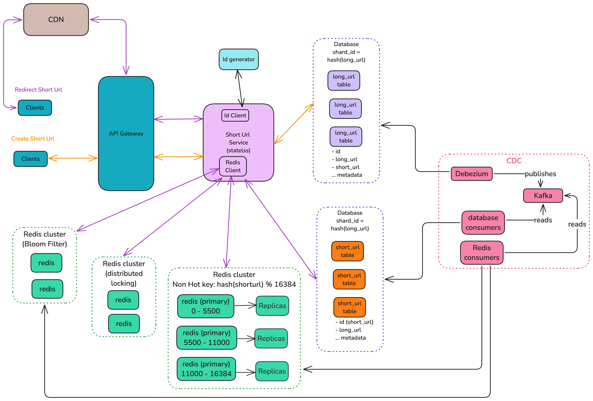
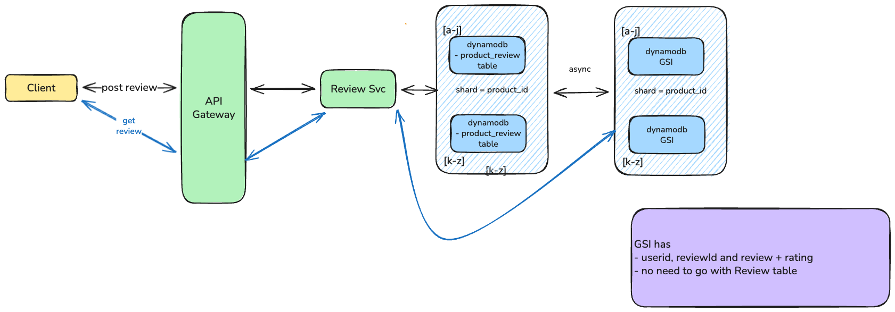

# SystemDesign

## Concepts

1. [Consistent Hashing](./Concepts/Hashing/consistent_hashing.md)
2. [DNS](./Concepts/DNS/dns.md)
3. [Debezium](./Concepts/Debezium/debezium.md)

## Softwares

1. [Debezium (CDD: Change data capture)](./Softwares/Debezium/)

## System design topics

1. [Design Short Url](./System-Designs/Design-Short-Url/Version-1.md)
   
2. [Design posting a review for a product system](./System-Designs/Design-Review-Posting-Service/HLD.md)
   
