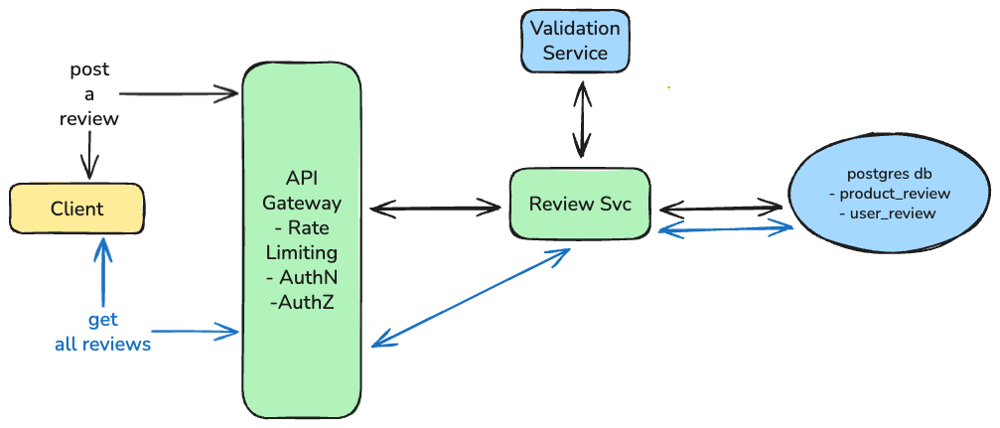
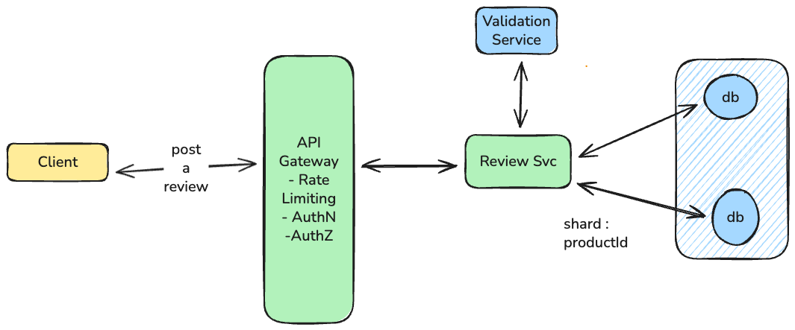
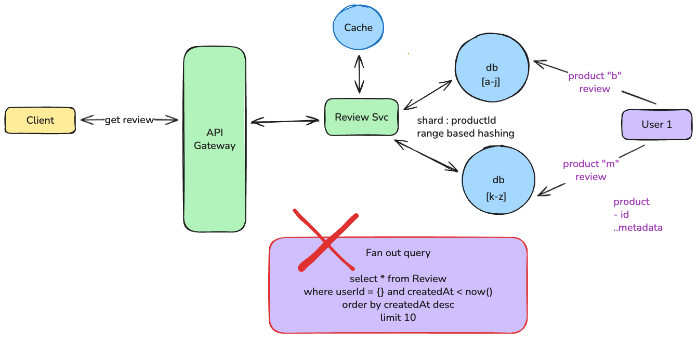
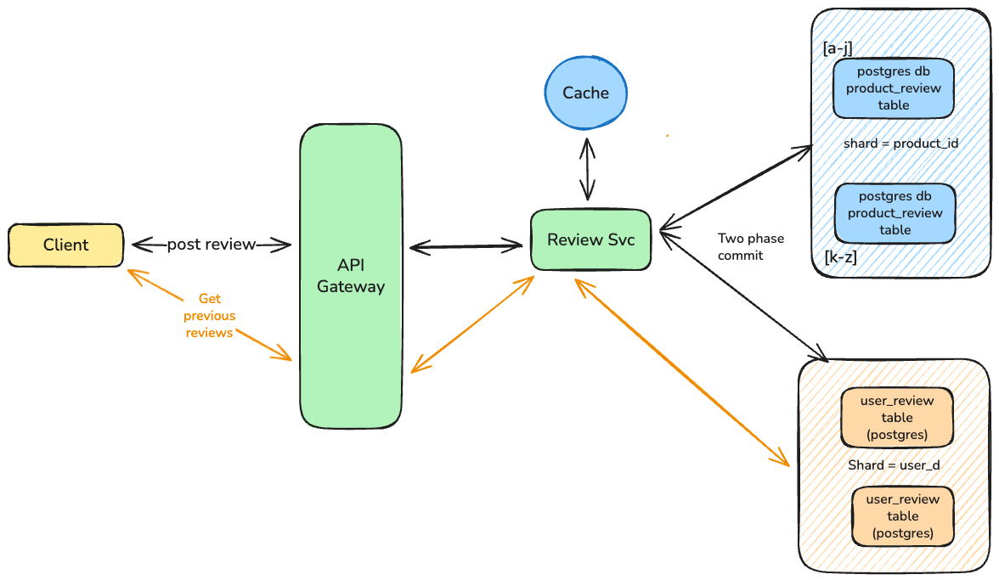
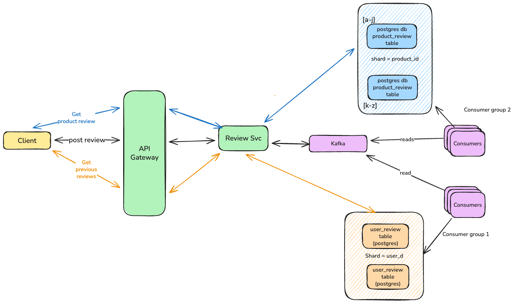
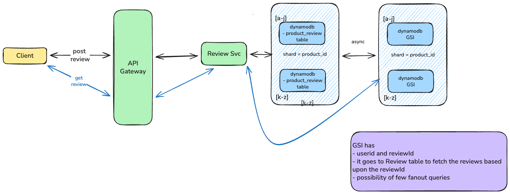
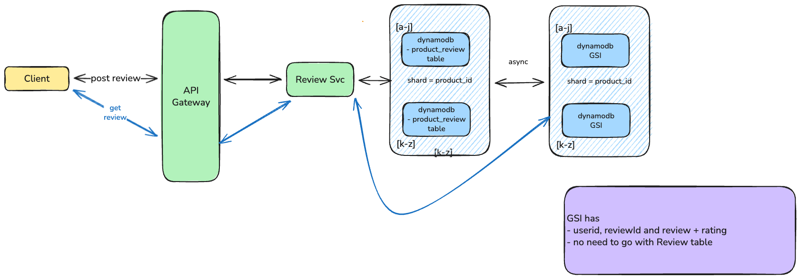

# Design review posting service

## Requirement

- User able to post a review for a product
- User able to view the review posted on a product
- User able to view its previous posts

## Non Functional Requirements

### Characteristic of the system

- System must be highly available
- Post a review for a product:
  - low latency
- User able to view its review for a product:
  - Prefer eventual consistency over strong
- User able to view its previous posts
  - decent latency should be enough

### Read heavy vs write heavy system

- System seems to have read heavy
  - Few user (0.1% of total active users) post a review
  - Very few users view their previous posts
  - Whenever product page is displayed, reviews are shown at the bottom

## High Level Design

At start, we focus on meeting the functional requirements of the system



### Post a review for a product flow

- User post a review which lands to **Review Svc** through API gateway which provides the few functionalities out of the box.
- **Validation svc** is called in sync which runs some basic validation (e.g. no abusive words etc)
- If validation failed, then user is informed
- else review is stored in the **product_review** table.

### Get the review for a product flow

- User requested the product page which lands to **Review Svc**
- It calls the **product_review** table to get the review posted

  ```sql
  select user_id, content
  from product_review
  where product_id = ?product_id
  order by created_at desc
  limit 10
  ```

- it returns the 10 reviews for a product

### Get the reviews posted by a user

- User opens the Review page under accounts section to see its previous reviews.
- Call lands to the **Review svc** which makes following query to get the 10 review

  -

  ```sql
  select user_id, content
  from product_review
  where user_id = ?user_id
  order by created_at desc
  limit 10
  ```

  ✅ Create Secondary key on user_id

  ```sql
  create index idx_user_id on product_review (user_id);
  ```

- it returns the result back.

✅ Functional requirements are completed.

## Scale the sytem

❌ **Product_review** table is in single db instances which wont scale with the load

## Scale the Product Review table



- Shard the **Product_review** table with`ShardId = product_id`

### Post a review for a product flow

- User post a review which lands to **Review Svc** followed by the **Validation svc**
- **Review svc** picks the shard based upon the `shardId=product_id` and writes the review in its table

✅ Handles the load successfully</br>
✅ Fetch review for a product</br>
🤔 How would it handle when user fetch its previous review?</br>
🧨 It turns out to be fan-out query



</br>

## 🤔 How to get rid of fan-out query

</br></br>

### Approach-1: 2PC (Two phase commit)

#### Post a review for a product flow

- When user post a review for a product, it calls **Review svc** it first start the validation
- After that it starts the 2PC



✅ Review is available on **Product_reivew** and **User_review** table.
❌ It introduces the complexity of 2PC
❌ Make the services coupled if **Product_review** and **User_review** tables are handled by different teams.

### Approach-2: CDC (Change data capture)


- Create separate **User_review** table
- Shard the table to handle the load
  - `shardId = user_id`

#### Post a review for a product flow

- When user post a review for a product, it calls **Review Svc**.
- It stores the review in **Product_review** table
- 200Ok Response send back to the user.

In parallel,

- The **insert** in this table is read by CDC (e.g. debezium) which publishes the content to the kafka topic
- A set of consumers read the messages and insert into **User_review** table.

#### Get the reviews posted by a user

- User opens the Review page under accounts section to see its previous reviews.
- Call lands to the **Review svc** which makes following query to get the 10 review

  ```sql
  select user_id, content
  from user_review
  where user_id = ?user_id
  order by created_at desc
  limit 10
  ```

### Approach-3: Async with Kafka consumer group

In this approach, we introduces async processing of reviews posted by Users.



#### Post a review for a product flow

- User post a review which lands to **Review Svc**.
- It publishes the review content in kafka topic and return `201 Accepted` to end user.

In parallel,

- Consumer group 1 (`Writing to **Product_review** table`) reads the message from the kafka topic and insert in table.
- Likewise, Consumer group 2 (`Writing to **User_review** table`) reads the message from the kafka topic and insert in table.

✅ System can handle any load or spikes. </br>
✅ Review content can be stored for any other purpose (e.g. auditing, training etc) by just adding another consumer group. </br>
❌ User wont see its recently posted review due to its async nature.
❌ More components to maintain.

#### Get the reviews posted by a user

- User opens the Review page under accounts section to see its previous reviews.
- Call lands to the **Review svc** which fetches the data from the **User_review** table.

✅ No fan-out
✅ **User_review** table can be scaled independently.
❌ User wont see its recently posted review due to its async nature.

### Approach-4: GSI (Global secondary index) with Key only

Databases like dynamodb provides the GSI functionality which is very same as having separate **User_review** table.



#### Post a review for a product floww

- User post a review which lands to **Review Svc**.
- It insert a row in the dynamodb's **Product_review** table.
- 200Ok response sent back to the user

In Parallel (handled by dynamodb managed option),

- Newly inserted row is sync to GSI table asynchronously.

✅ Less component to manage as Dynamodb is a managed service</br>
❌ User wont see its recently posted as Data is stored in GSI table asynchronously.</br>
❌ Fan-out still possible as GSI only gives product_id to fetch the review content.

### Approach-5 (Improvement from Approach 4): GST (Global secondary index) with Key and content

In this case, the only difference is that we store Review content along with user_id, review_id in **GSI** table.



✅ Less component to manage as Dynamodb is a managed service</br>
✅ No fan-out as GSI contains the review posted by user.</br>
❌ User wont see its recently posted as Data is stored in GSI table asynchronously.</br>
❌ Higher storage which impact the cost of the system

## Conclusion

Above shows multiple options to implement this feature. Pick the one which satisfy the requirement.
Without considering the future enhancement of the systems, I would pick dynamodb with key and content option.
