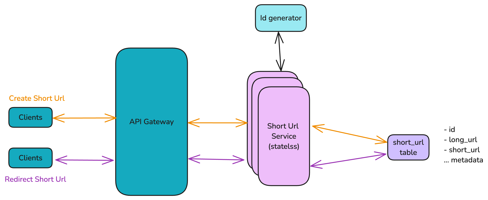
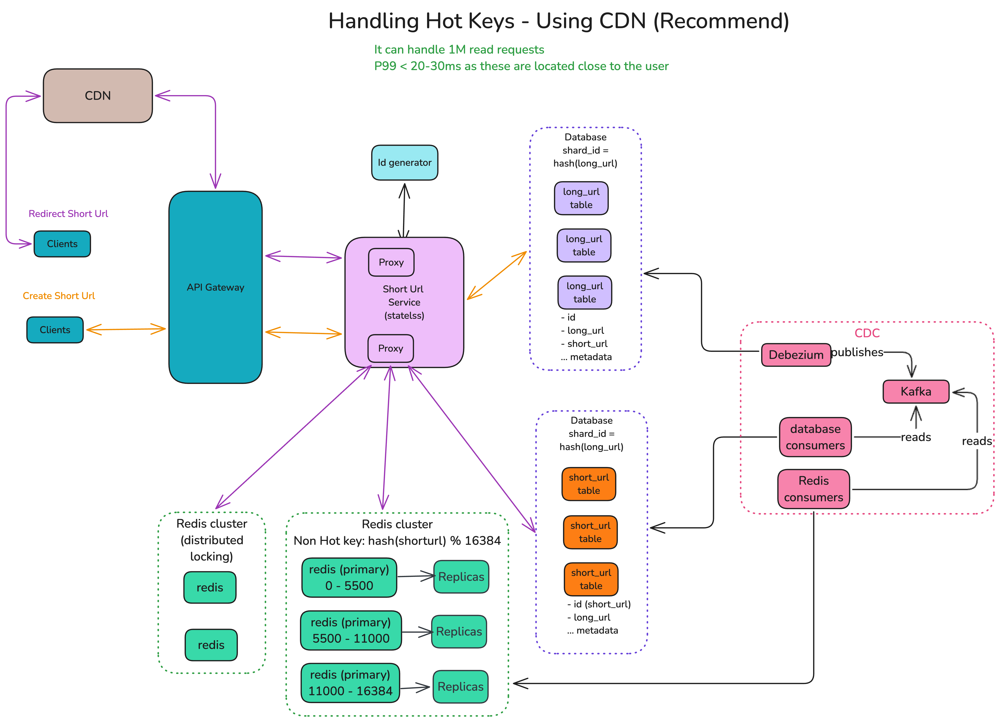
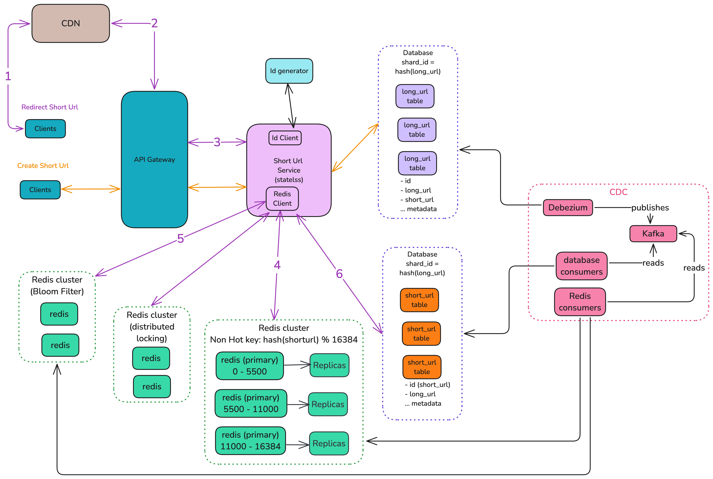

# Final High Level Design

# Requirements

1. User provides the long url and get a short url.
2. User input the short url and get directed to long url.
3. User can provide custom alias as short url.

# Questions asked to the Interviewer

[Questions](./Questions-asked.md)

# Functional Requirements

1. User able to get short url for a given long url.
2. User able to assign custom alias to a given long url.
3. User is redirected to long url when short url is entered.

# Non functional requirements

1. Short url is hard to guess
2. Long url to short url is idempotent.
3. Durability ensured.
4. Short url size:
   1. Total = 8 characters
   2. 62 ^6 = 56B
   3. considering collision,future growth etc => +2 bytes
5. Write path:
   1. 3 9s of availability.
   2. 100-200ms of local write latency.
   3. Eventual consistency (local and global)
   4. Custom alias available -> Strong consistency.
6. Read path:
   1. 4 9s of availability.
   2. 20-30ms global read latency
   3. Eventual consistency (local and global)
7. Storage:
   1. 40 TB for 10 year \* index (1-2x) \* replication (3x) = 40 \* 5x = 200 TB
   2. This don't include the storage required for analytics

# Scale

1. 10M writes per day -> 10 M \* 365 days -> 3.6B write per year -> 36B writes for 10 years
2. Write per day = 10ˆ7 / 10ˆ5 = 100 per second
3. Read = 10x of write
   1. 10ˆ3 per second
   2. During peak = 10ˆ4 per second
4. Storage:
   1. per entry
      1. Long url = 1000 bytes
      2. id = 20 bytes
      3. user_id = 20 bytes (for guest user, unique id generated and store in browser. This acts as idempotent key)
      4. total = 1200 bytes per entry
   2. 36 B \* 1.2 \* 10ˆ3 bytes = 40 TB for 10 years

## High Level design

Start with the basic high level design which satisfy the functional requirements.

### Meeting the functional requirements

#### Create Short Url Flow

1. Call lands to Short Url service
2. It fetches the short url id from the id generator service.
3. Saves the information in the db
   1. long url
   2. short url
   3. other metadata
4. Once saved, it returns the short url back to the user.

#### Redirect shorl url

1. When user enters the short url at the browser, call lands to our service.
2. Short url service fetches the long url from the database which matches the short url (where condition).
3. It sends the 301 redirect http status with long url insider http header with key = location.
4. User's browser fetches the long url from the header and redirect.

👍 this just satisfy the functional requirements.
👉 Now scale the system by focusing on one component at a time.

### 👉 Scale Db to handle the load

Lets handle the non functional requriments by Scaling the database.

#### Create Short Url Flow

- call lands to Short Url service
- it calls Id generator to get the unique short Url
- save the mapping the database
  - get db instance by using long_url
  - save the entry in the db
- return the short url to the user

#### Redirect Short Url

- call lands to Short Url service
- fetches the mapping from the database
- return the long url to the short Url service
- redirect the user by setting Location header in the response.

#### Sync between two databases using CDC

- Used debezium here which reads the messages from the WAL
- push them in the Kafka
- database consumer reads the message from the kafka
  - add the entry in the db

### Ensuring regional low latency

Fetch the data from the Redis cluster to ensure low latency.

#### CDC (Change Data capture)

- Used debezium here which reads the messages from the WAL
- push them in the Kafka
- Consumers
  - database consumer
    - reads the message from the kafka
    - add the entry in the db
  - Redis consumer
    - read message from kafka
    - add it in the redis cache

### Handle Cache Stampede

Cache stampede happens when there is cache miss and all servers or threads go to the database to fetch it. These causes load at the database which may result in crash.

#### Redirect Short Url (when cache hit)

- call lands to Short Url service
- fetches the mapping from the cache if present
- return the long url to the short Url service
- redirect the user by setting Location header in the response.

#### Redirect Short Url (when cache miss)

- call lands to Short Url service
- fetches the mapping from the cache
  - cache miss
  - try to get the lock
  - if not acquired, do exponentail backoff with jitter
  - else,
    - get the mapping from the short_url table
    - update the cache
- return the long url to the short Url service
- redirect the user by setting Location header in the response.

### Handle Hot Keys

#### with Sharded Redis Cache

Instead of having fewer redis cache instances, throw more instances within cluster which somewhat handles the load.
👍 It can handle the hot keys problem upto a level without going into the complexity of it.
❌ It can't handle once it cross the limit.

#### with Random Suffix

This technique is used when previous technique of handling the hot key fails. In this case, a random suffix (between 1 - N. e.g. N = 10) with key.
👍 It can handle the hot keys problem well.
❌ It introduces the complexity in the system.
❌ Requires extra knowledge about which keys are hot keys. We can use any db for the same.

#### using CDN

##### Redirect Short Url (when CDN cache hit)

- User connects with CDN
- it redirects the user to long url.

##### CDN (update cache)

- CDN call lands to Short Url service
- fetches the mapping from the cache
  - cache miss
  - try to get the lock
  - if not acquired, do exponentail backoff with jitter
  - else,
    - get the mapping from the short_url table
    - update the cache
- return the long url to the short Url service
- redirect the user by setting Location header in the response.

👍 No need to handle the hot keys problem using random suffix
👍 CDNs are designed to handle the hot keys problem well.
👍 No need to handle cache stampede problem which is handle at CDN side.
❌ It introduces the cost to the system.

### Handle Non existing Short Url

#### ❌ Without Handling of Non existing Short url

- Call lands to CDN first, it couldn't find entry in its cache
- CDN calls to Short Url Service,
  - it first looks for it in Redis -> cache miss
  - it goes to database -> no entry found
- return NOT FOUND to CDN
- CDN returns the appropriate error to the user.

#### 👍 Handling of Non existing Short url

- Call lands to CDN first, it couldn't find entry in its cache
- CDN calls to Short Url Service,
  - it first looks for it in Redis -> cache miss
  - it looks entry in the bloom filter
    - Since its probablistic, it may fail to identify the non existence of the given short url.
  - it goes to database -> no entry found
- return NOT FOUND to CDN
- CDN returns the appropriate error to the user.

👍 Bloom filter handles the non existance short url and prevent database from crashing
🤔 Bloom filter doesn't completely eliminate the db call.
❌ It introduces the cost to the system by adding more redis instances for Bloom filter.

### Final Version

# Id Generator Service

There are multiple options to select the ids.

1. Random Id
2. Sequential ID
3. UUID
4. ULID
5. Snowflake

Each of these have some issue. (we'll cover separately)

#### Snowflake + Permutated Id

#### Steps

1. Generate Snowflake id which is 64 bits or 8 bytes
2. Get 11 character Bas2 62 sized Short Url
   1. For 64 bits and Base 62 characters for short url,
      1. we get 5.95 bits per character
         1. 62 is between 2^5 and 2^6
      2. for 64 bits, we need 11 characters
         1. 64 / 5.95 = ~10.75
3. Permutate it using Feistel_cipher (look at [References](#references) section) to ensure zero predictability.

👍 The Id generated is almost impossible to guess.
👍 We dont store this permuted id in the database.
👍 This permuted id generated is reversible.

# References

1. [Feistel_cipher](https://en.wikipedia.org/wiki/Feistel_cipher)
