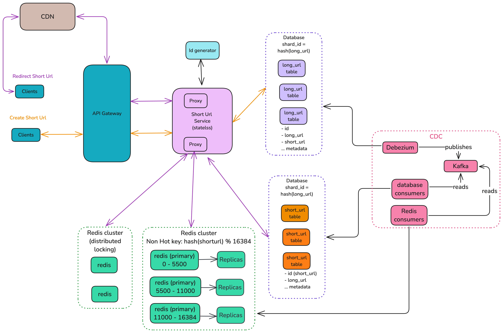
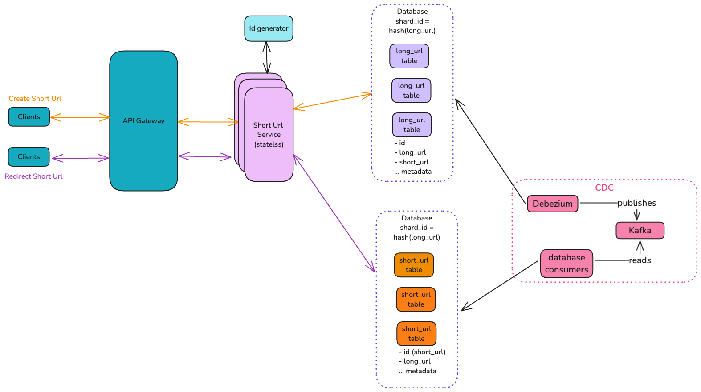
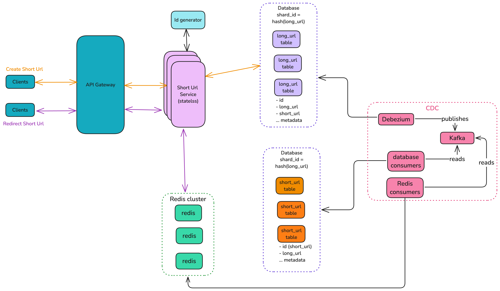
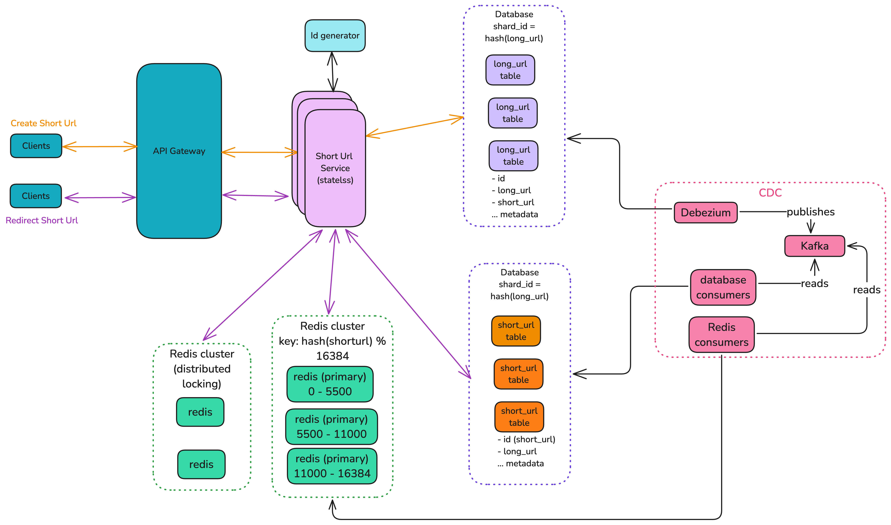
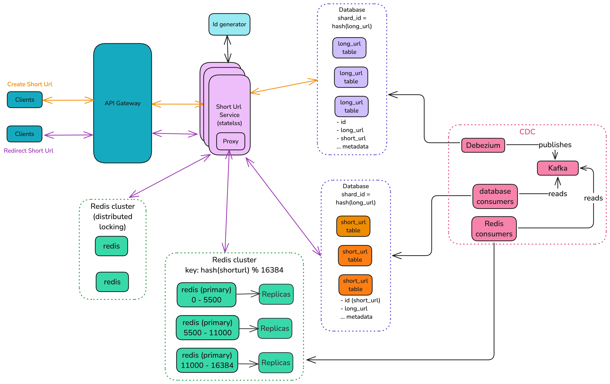
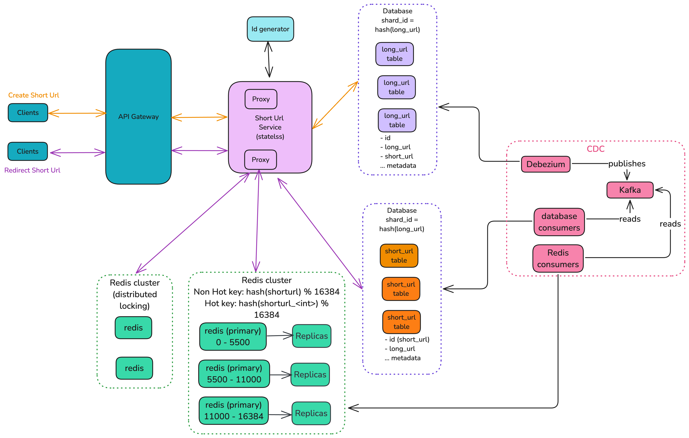

# Requirements

1. User provides the long url and get a short url.
2. User input the short url and get directed to long url.
3. User can provide custom alias as short url.

# Questions asked to the Interviewer

[Questions](./Questions-asked.md)

# Functional Requirements

1. User able to get short url for a given long url.
2. User able to assign custom alias to a given long url.
3. User is redirected to long url when short url is entered.

# Non functional requirements

1. Short url is hard to guess
2. Long url to short url is idempotent.
3. Durability ensured.
4. Short url size:
   1. Total = 8 characters
   2. 62 ^6 = 56B
   3. considering collision,future growth etc => +2 bytes
5. Write path:
   1. 3 9s of availability.
   2. 100-200ms of local write latency.
   3. Eventual consistency (local and global)
   4. Custom alias available -> Strong consistency.
6. Read path:
   1. 4 9s of availability.
   2. 20-30ms global read latency
   3. Eventual consistency (local and global)
7. Storage:
   1. 40 TB for 10 year \* index (1-2x) \* replication (3x) = 40 \* 5x = 200 TB
   2. This don't include the storage required for analytics

# Scale

1. 10M writes per day -> 10 M \* 365 days -> 3.6B write per year -> 36B writes for 10 years
2. Write per day = 10ˆ7 / 10ˆ5 = 100 per second
3. Read = 10x of write
   1. 10ˆ3 per second
   2. During peak = 10ˆ4 per second
4. Storage:
   1. per entry
      1. Long url = 1000 bytes
      2. id = 20 bytes
      3. user_id = 20 bytes (for guest user, unique id generated and store in browser. This acts as idempotent key)
      4. total = 1200 bytes per entry
   2. 36 B \* 1.2 \* 10ˆ3 bytes = 40 TB for 10 years

## High Level design

### Scale Db to handle the load

### Ensuring regional low latency

### Handle Cache Stampede

### Handle Hot Keys with Sharded Redis Cache

### Handle Hot Keys with Random Suffix

### Final Version

### Short Url Ids

[Alternate Options explored](./Short-Url-Ids-Alternate-Options.md)

#### Snowflake + Permutated Id

#### Steps

1. Generate Snowflake id which is 64 bits or 8 bytes
2. Get 11 character Bas2 62 sized Short Url
   1. For 64 bits and Base 62 characters for short url,
      1. we get 5.95 bits per character
         1. 62 is between 2^5 and 2^6
      2. for 64 bits, we need 11 characters
         1. 64 / 5.95 = ~10.75
3. Permutate it using Feistel_cipher (look at [References](#references) section) to ensure zero predictability.

# References

1. [Feistel_cipher](https://en.wikipedia.org/wiki/Feistel_cipher)
