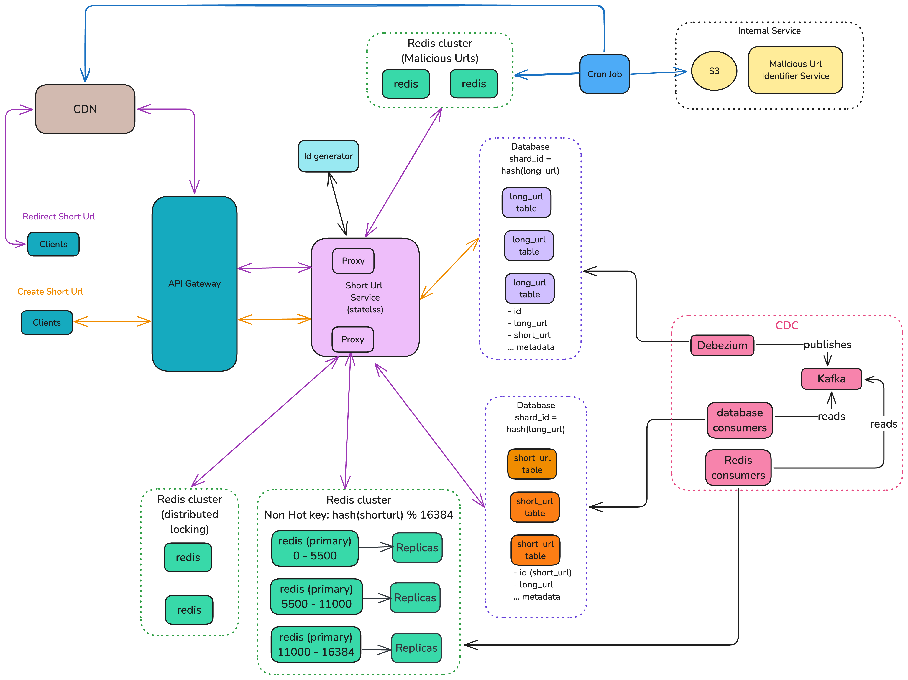

# Version 2

## Requirements

1. Block the malicious Url identified.

## High Level Design

Internal Service **Malicious Url Identifier Service** identify the malicious long url and update the AWS S3.

### Cron Job

1. It reads the latest file from AWS S3
2. Update the Redis cache with malicious urls.
3. Update the CDN KV with malicious Urls.

### Redirect Short Url Flow

1. User entered the short Url.
2. Call lands to the nearest CDN.
3. It gets the long url of given short Url.
4. It verify the long url:
   1. If its malicious, return the error page to the user.
   2. If not, redirect the user to the long Url.

### CDN Cache miss or CDN cache Update flow

1. User entered the short Url to the browser.
2. Call lands to the nearest CDN.
3. CDN couldn't find the entry in its cache.
4. It calls the pre-configured API endpoint to get the long url.
5. Call lands to Short Url service
6. It fetches the short url to long url mapping from the Redis cache.
7. It then checks whether long url is malicious.
   1. If yes then return error to the CDN
   2. else, return the long url.
8. CDN updates its cache accordingly.
9. Return to the user accordingly.

