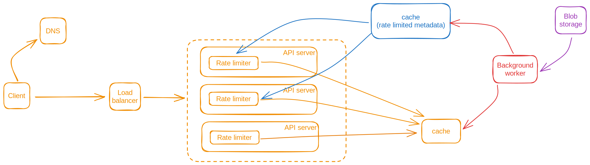
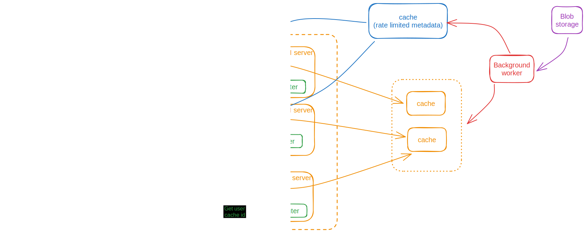

# Rate Limiter Service

- [Rate Limiter Service](#rate-limiter-service)
  - [Clarifying questions](#clarifying-questions)
  - [Back of the envelop estimation](#back-of-the-envelop-estimation)
    - [Calculations](#calculations)
  - [Defining the bottleneck](#defining-the-bottleneck)
  - [High Level Design](#high-level-design)
    - [High level design - Placing Rate limiter on API server](#high-level-design---placing-rate-limiter-on-api-server)

Rate limiter is used to **limit the number of client requests** to be served by the server **over a period of time**. Beyond that, server starts to reject it with **Http status code as 429 too many requests**.

## Clarifying questions
1. What kind of rate limiter we are going to design? **Client-side** or **server-side**? </br>
    Ans: Server side
1. Do we need to inform user being throttled? </br>
    Ans: Yes.
1. What are all the criteria's to apply rate limiter on? IP address, client id etc. </br>
    Ans: Design service in such a way so that it can support different throttling rules.

## Back of the envelop estimation

Back of the envelop estimation is fully focused on the **load on the cache** which are:
1. Number of connections established with cache.
2. Storage needed for holding current user call count.
3. Number of calls is made to the cache.

### Calculations
1. Rate limit set for each users = 10 per second
2. Number of user : 100 million per day
3. Number of active users at peak (for a second) = 10% of total users

    ```java
    // At peak, 10% of the total users using our service.
    number of users at peak = 0.1 * 100 million
                            = 10 million
    ```
4. Total number of calls made to the cache per sec = 10 million (at peak) * 10 per second for each users
    ```java
    call to cache per sec at peak = 10 * 10^6 * 10
                                    = 100 * 10^6
                                    = 100 million
    ```

5. Cache storage required = 0.5 gb * 2 = 1 gb

    ```java
    // 5 calls per sec from a users is the limit set
    total users making requests per second = 10 million users

    // information is stored in {key, value} format
    // key: client id (46 bytes), value: short (4 bytes) = 50 bytes
    storage = (key, value tuple) * total users
            = 50 bytes * 10* 10^6
            = 0.5 gb
    ```
6. Total number of servers serving the user at peak = 100 which is equal to the total number of connections stablished with cache.

## Defining the bottleneck
1. Number of calls made to the cache, **which is 100 million**, could be the bottleneck 

## High Level Design

### High level design - Placing Rate limiter on API server

**Rate limiter** is a module which is part of the API server and whenever user call lands to the API server, Rate limiter module fetches the current call count over a specified duration by making call to the cache.



As per [bottleneck](#defining-the-bottleneck), we need to design the cache in such a way so that it can handle the load which is number of calls it may receive during peak hours.

We need to **hash the user** and use **consistent hashing** algorithm to get the cache storing the user information.</br>
**User router** module accepts the user id and return the cache id where user information is stored.



