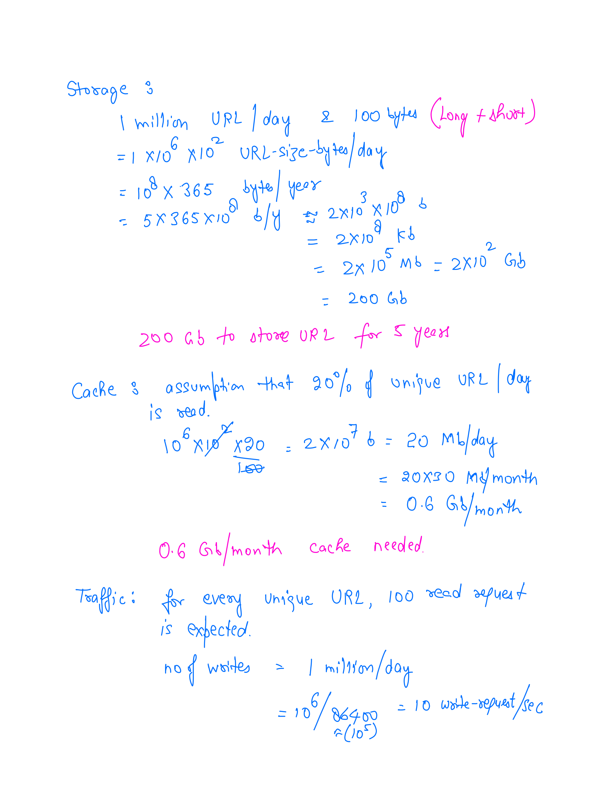

# Url Shortener Service Version 1

## Table of content
1. [Freeze the scope](#freeze-the-scope)
1. [Back of the envelop estimation](#back-to-the-envelop-estimation)

## Freeze the scope

1. How many unique urls expected to be received per day?
    * Answer: 1 million
1. What are the allowed characters in short url?
    * Answer: 0-9, a-z, A-Z
1. What is the retention period of this mapping?
    * Answer: 5 years
1. Can the url be updated or deleted?
    * Answer: skip for now.
1. Characteristics of short URL
    * It shouldn't be guessable.

### Back-to-the-envelop Estimation

Assumption:
1. Average Long URl length is 100 bytes
1. Object being stored in db is around Length of Short URL + Length of Long URL + (some other info) = 
1. **Read to write** ratio is **100:1**

