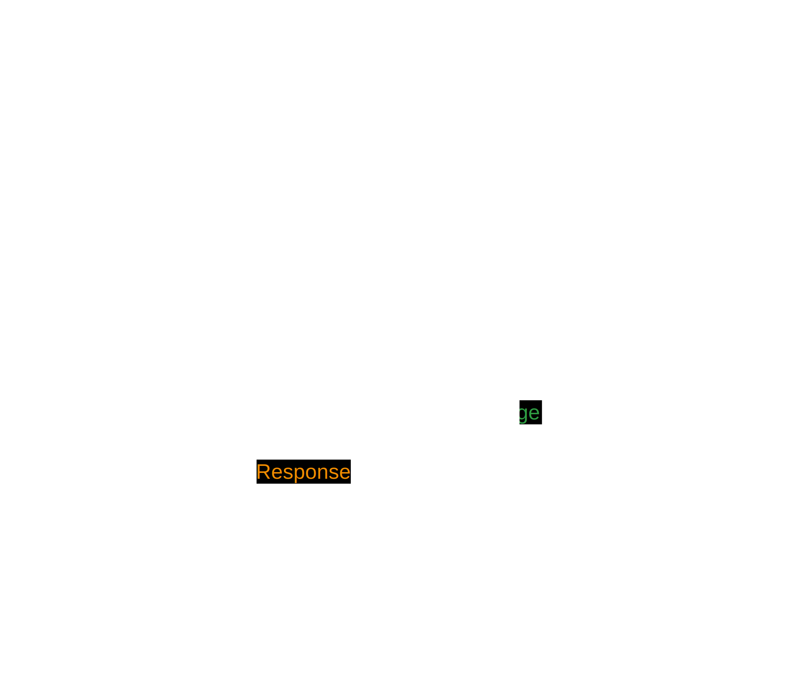
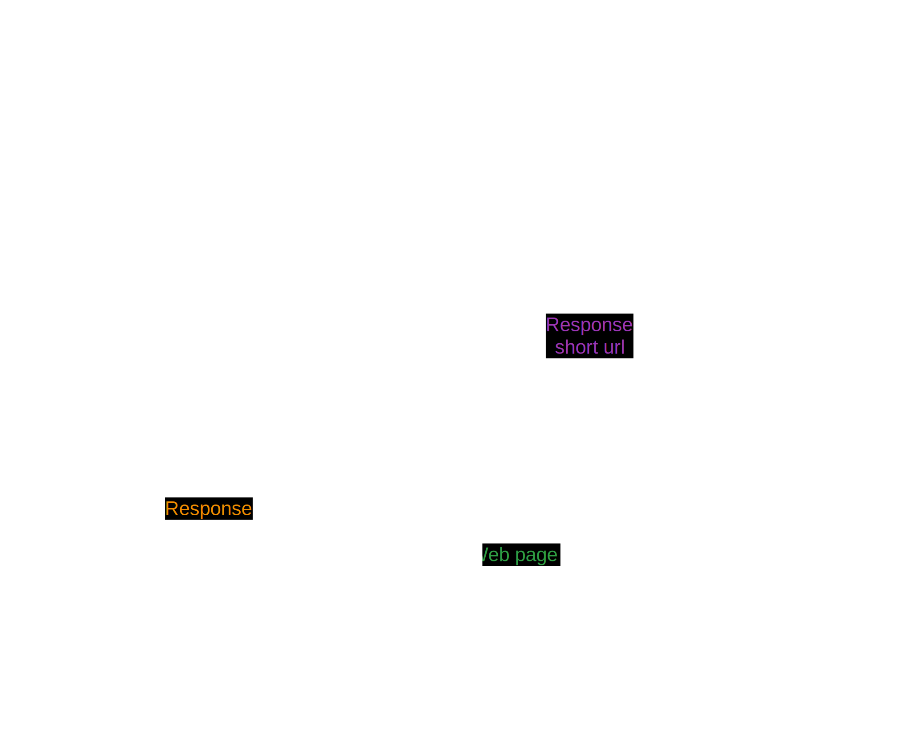
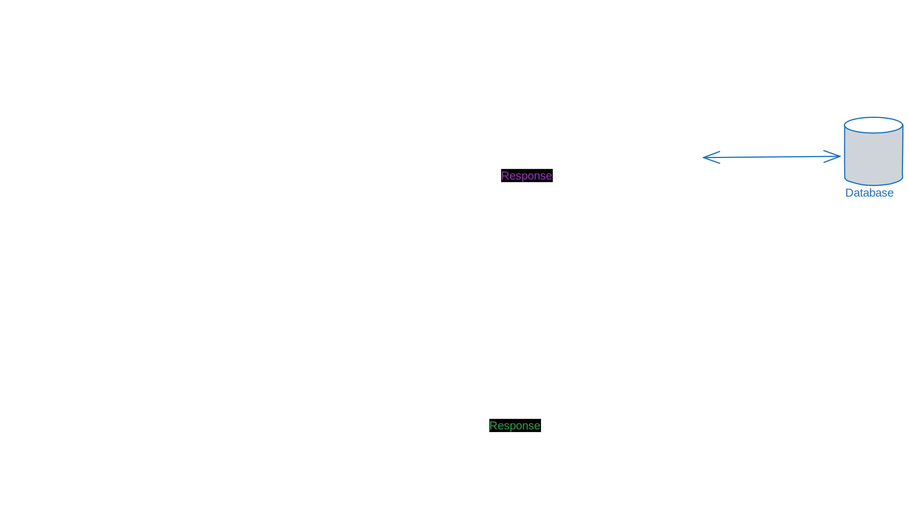
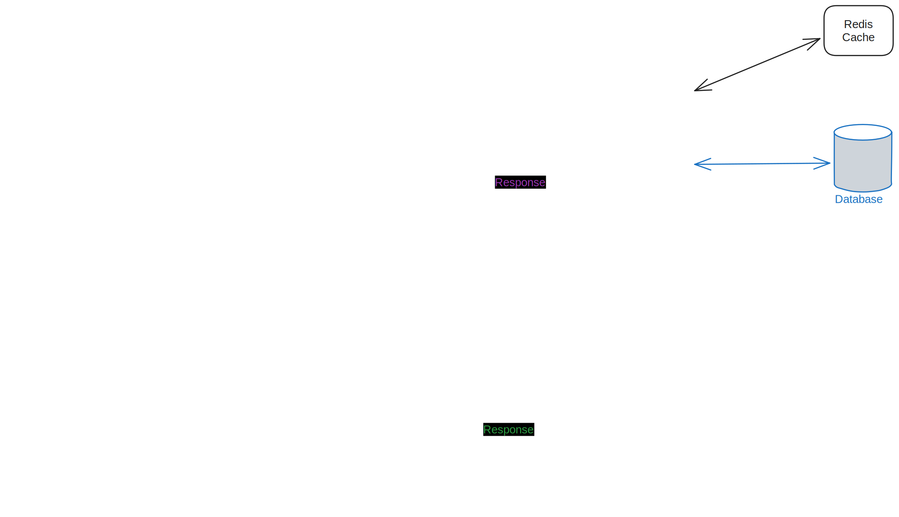

# URL shortener service - Version 1

- [URL shortener service - Version 1](#url-shortener-service---version-1)
  - [Clarifying questions](#clarifying-questions)
  - [Requirement summary](#requirement-summary)
  - [Back of the envelop estimation](#back-of-the-envelop-estimation)
  - [High level design](#high-level-design)


Lets start designing the system from consumer/client side which is web browser in this scenario. Client interacts with the API server to perform following:

## Clarifying questions
1. Do we need to ask user to sign-in before using our service?</br>
    Ans: No
1. What are the allowed characters in the short url? </br>
    Ans: a-z, A-Z, 0-9
1. Is user allowed to delete or update the short-long url mapping? </br>
    Ans: No (for now)
1. For how long, short-long url mapping be stored?</br>
    Ans: 10 years.
1. Do we need to leverage the previously generated short url for popular website like google.com, facebook.com etc? <br>
    Ans: No. (for now)
1. Can we assume that web browser is the potential client or not? </br>
    Ans: assume web browser for now
1. Can we assume the url generation requests per day is close to 100 million? </br>
    Ans: yes
1. Can we assume that write to read ratio is 1: 10? </br>
    Ans: yes

## Requirement summary
1. User without sign-in shares the long url and get the short url in return.
1. User enters the short url on browser and successfully gets redirected to long url.
1. a-z, A-Z, 0-9 are the allowed characters in the shortened url. It means (62 characters in total are allowed).
1. Shortened url once created is not deleted or updated.
1. Generate separate short URL even for popular sites like google.com, netflix.com etc. for every user.
1. Web browser is the client of the system.

## Back of the envelop estimation
1. Estimate the size of the short url. </br>
    as per below calculation, we are good with length = <span style="color:blue">7</span>

    ```java
        // 100 million requests per day for 10 years
        total unique requests = 100 * 10^6 * 365 * 10
                              = 365 * 10^9
                              = 365 billion
        62 ^ 7 = 3521 billion
    ```
1. <span style="color:blue">100 million</span> requests for short url generation per day 
1.  Read to write ration is <span style="color:blue">10 : 1</span>

    ```java
        write request = 100 million per day
        read request = 10 * write request per day
                        = 10 * 100 million
                        = 1 billion requests per day
    ```

1.  Storage estimation to store data for <span style="color:blue">10 years</span>

    ``` java
        // we receive 100 million unique long url requests per day
        // for next 10 years
        int total_records_to_be_stored_for_10_years = 100 million * (365 days * 10 years)
                                        = 100 * 10^6 * 3650
                                        = 365 * 10^9 records
        
        // each record consists for following
        // {id, long_url, short_url, user_id}
        // {50, 200, 8, 42} = 300 bytes

        total space needed for 10 years = 365 * 10^9 * 300 bytes
                                        = 365 * 300 gb
                                        ~= 900 * 100 gb
                                        = 90 tb
    ```

1. Cache: We need to serve 20% of the total read requests we receive per day

    ```java
        cache storage = 1 * 10^9 * (20/100) records
        //each record contains key and value
        // key: 100 bytes
        // value: 200 bytes

        each record size = 300 bytes
        total storage = 10^9 * 0.2 * 300 bytes
                    = 60 gb
    ```

## High level design

To start with, user uses the its <span style="color:#e03131"> **browser**</span> to hit the <span style="color:violet">**url**</span> of our url shortener service and expect to see the website.


As this is mostly a static content, we should consider serving it from <span style="color:#f08c00">**CDN (Content delivery network)**</span>



User enters the long url which interacts with <span style="color:#9c36b5">**API server**</span> to accept long url and return the short url.



As user grows, single API server or Web server won't be able to send response in time and hence we need to throw more servers into it. To uniformaly distribute the load to all the servers, we add <span style="color:#846358">**Load balancer**</span>


We need some kind of data storage to store the data and fetch it efficiently. For that, we can use <span style="color:#846358">**Database**</span>



To reduce the response time of most requested short urls, store it in cache and serve from it.

